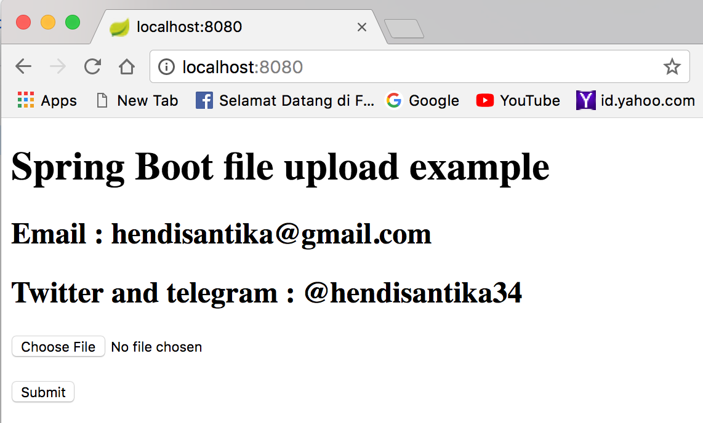
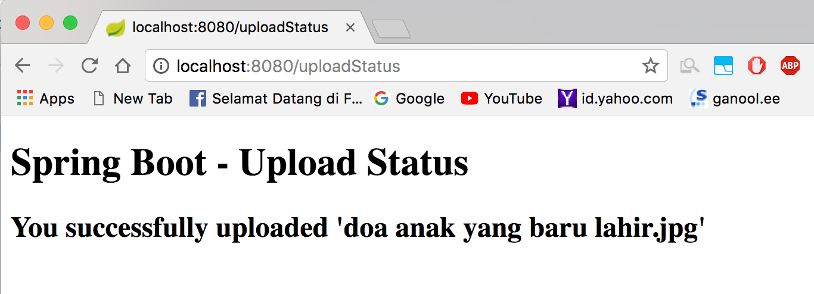

gi# spring-boot-file-upload-example

This article shows you how to upload a file in Spring Boot web application.

Tools used :

1. Spring Boot 1.5.8.RELEASE
2. Spring 4.3.7.RELEASE
3. Thymeleaf
4. Maven
5. Embedded Tomcat 8.5.6

How to run this repo :

open your terminal then type this command :
`mvn clean spring-boot:run`

open your browser :
`http://localhost:8080`

